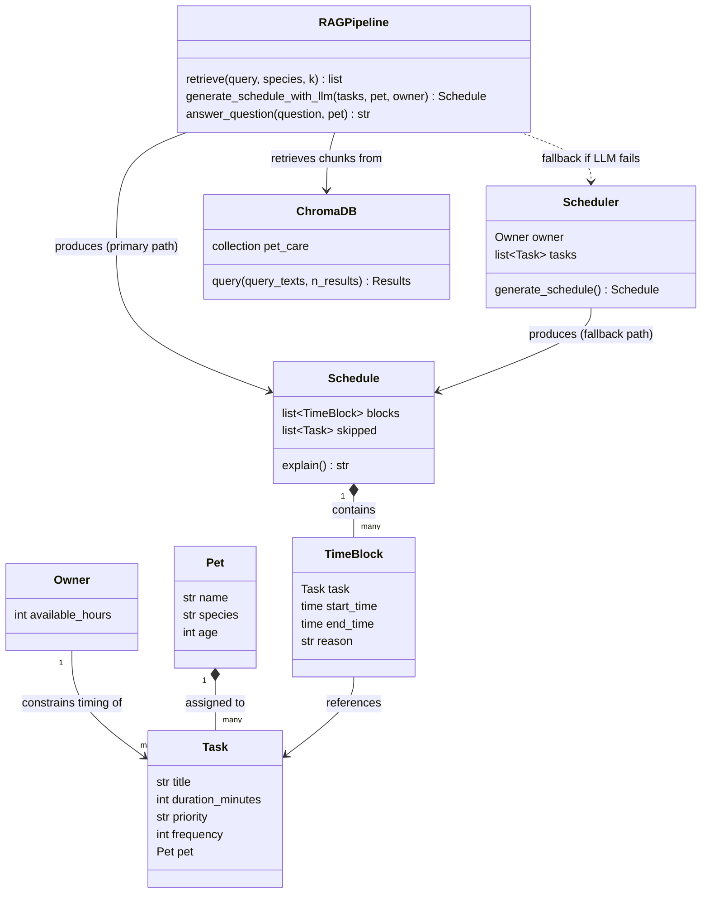

# PawPal+ — AI-Grounded Pet Care Scheduler

## Original Project (Modules 1–3)

The original **PawPal+** was a rule-based pet care planning assistant built in Modules 1–3. Owners could enter a pet's name and species, add care tasks with durations and priorities, and generate a daily schedule. The scheduler used a greedy, priority-sorted algorithm to fit tasks into an 8-hour time budget starting at 8:00 AM, and the "reason" attached to each scheduled task was a static string like `Scheduled: priority=high`. It had no AI component and no understanding of what time of day tasks should realistically happen.

---

## Title and Summary

**PawPal+** is an AI-powered pet care scheduling assistant that builds realistic daily schedules grounded in real veterinary guidelines. Rather than just sorting tasks by priority, the system understands that a dog's evening walk belongs at 5:30 PM, that feedings should be 8–12 hours apart, and that there are documented reasons behind each of those choices — pulled from ASPCA, AKC, and AVMA published care guidelines.

This matters because generic pet care apps tell you *what* to do. PawPal+ tells you *what, when, and why* — with the "why" traceable to actual veterinary sources.

---

## Demo Walkthrough

> **Add your Loom link here before submitting:** `https://www.loom.com/share/...`
>
> The walkthrough should show: (1) loading default dog tasks and generating a schedule, (2) the schedule table with grounded reasons and citations, (3) at least one sidebar chat question and answer.

---

## Architecture Overview

```
knowledge_base/ (10 markdown docs — scraped ASPCA + curated vet guidelines)
        │
        ▼  [one-time setup]
scripts/build_kb.py
  → chunks each doc into ~400-word overlapping segments
  → embeds chunks with sentence-transformers (all-MiniLM-L6-v2, runs locally)
  → stores vectors + metadata in ChromaDB (.chroma/ on disk)

━━━━━━━━━━━━━━━━━━━━━━━━━━━━━━  runtime  ━━━━━━━━━━━━━━━━━━━━━━━━━━━━━━

app.py (Streamlit UI)
  Inputs: pet name, species, hours available today
  Actions: add tasks manually  OR  load species defaults

        │  tasks + pet + available_hours
        ▼
rag.py → generate_schedule_with_llm()
  1. Builds a query from all task titles + species
  2. Retrieves top-6 relevant chunks from ChromaDB
  3. Expands frequency > 1 tasks (e.g. Feeding x2 → two entries)
  4. Sends expanded task list + retrieved vet context to Claude (claude-haiku-4-5)
  5. Claude returns a JSON array: one entry per task block with time, duration, rationale
  6. _parse_schedule_json() sanitises the response:
       strips markdown fences → extracts [...] → validates fields → fuzzy-matches task names
  7. Appends source citations to each rationale string
  8. On any failure → falls back to rule-based Scheduler (models.py)

        │  Schedule (list of TimeBlock objects)
        ▼
app.py — renders schedule table (AM/PM times, task, grounded reason + citation)

rag.py → answer_question()          [sidebar chat, independent of schedule]
  1. Retrieves top-4 chunks relevant to the question + species
  2. Sends chunks + question to Claude
  3. Returns a 3–5 sentence grounded answer with source attribution
```

A flowchart version of this diagram is also available in [assets/architecture.md](assets/architecture.md).

The RAG layer serves two distinct purposes: it provides the *language* for rationale (specific claims like "prevents indoor accidents" and "8–12 hours between feedings" come from the retrieved documents), and it makes those claims *traceable* — every reason in the schedule table cites the source document it came from.

### Class Diagram



---

## Setup Instructions

**Requirements:** Python 3.11+, an Anthropic API key.

```bash
# 1. Clone the repo and enter the project directory
cd applied-ai-system-project

# 2. Create and activate a virtual environment
python3 -m venv .venv
source .venv/bin/activate

# 3. Install dependencies
pip install -r requirements.txt

# 4. Add your Anthropic API key
# Create a .env file in the project root:
echo "ANTHROPIC_API_KEY=sk-ant-..." > .env

# 5. Build the knowledge base index (one-time setup)
python scripts/build_kb.py

# 6. Run the app
streamlit run app.py
```

The knowledge base build downloads the `all-MiniLM-L6-v2` embedding model (~80MB) on first run and writes a `.chroma/` directory. Subsequent runs load from disk instantly.

To rebuild the index after editing or adding documents in `knowledge_base/`, re-run step 5.

---

## Sample Interactions

### 1. Dog schedule — default tasks

**Input:** Pet: Mochi (dog), Hours available: 8, click "Load defaults for species", click "Generate schedule"

**Output:**

| Start | Task | Why |
|---|---|---|
| 8:00 AM | Morning walk | Start of owner availability; essential morning exercise for bowel regulation. (Source: ASPCA/AKC/AVMA guidelines, ASPCA) |
| 8:35 AM | Feeding | Post-walk feeding; first meal of the day after morning exercise. (Source: ASPCA/AKC/AVMA guidelines, ASPCA) |
| 9:00 AM | Water refresh | After morning walk and feeding; ensures fresh water availability. (Source: ASPCA/AKC/AVMA guidelines, ASPCA) |
| 10:30 AM | Playtime | Mid-morning mental stimulation and activity during owner availability. (Source: ASPCA/AKC/AVMA guidelines, ASPCA) |
| 12:00 PM | Grooming | Midday grooming maintenance during owner availability window. (Source: ASPCA) |
| 4:00 PM | Feeding | Second meal spaced 8+ hours from first feeding. (Source: ASPCA/AKC/AVMA guidelines, ASPCA) |
| 4:15 PM | Water refresh | After second feeding; final water refresh before evening walk. (Source: ASPCA/AKC/AVMA guidelines, ASPCA) |
| 5:30 PM | Evening walk | Evening exercise within 5–7 PM window; releases daily accumulated energy. (Source: ASPCA/AKC/AVMA guidelines, ASPCA) |

---

### 2. Sidebar chat — hydration question

**Input:** "How often should I refresh my dog's water bowl?"

**Output:**
> Great question! According to the guidelines, water bowls should be refreshed with clean, fresh water at least once daily — twice daily is better, especially in warm weather. Standing water accumulates bacteria, saliva, and food debris quickly, which can make the water less appealing to your pup. Stainless steel or ceramic bowls are easiest to keep clean and don't harbor bacteria the way plastic bowls can.

---

### 3. Sidebar chat — cat feeding question

**Input:** "Is it okay to leave dry food out all day for my cat?"

**Output:**
> Free-choice feeding (leaving dry food out continuously) is possible but comes with a risk: some cats will overeat, which can lead to obesity over time. The ASPCA recommends portion-controlled meals twice daily, spaced 8–12 hours apart, as the safer default. If your cat is a grazer and maintains a healthy weight, free-choice dry food can work, but it's worth monitoring closely.

---

## Design Decisions

**Why LLM scheduling instead of rule-based?**
The original greedy scheduler had no concept of time-of-day appropriateness. It scheduled an "Evening walk" at 8:40 AM and fed a dog twice within 10 minutes because it only understood priority, not context. Replacing the scheduling logic with a Claude call — grounded in retrieved vet docs — produces schedules that match how a person would actually plan a pet's day. The rule-based `Scheduler` is kept in `models.py` as a fallback.

**Why ChromaDB + sentence-transformers instead of a hosted vector store?**
This is a local, single-user app with a small knowledge base (10 documents). ChromaDB stores the index on disk and loads it instantly. `all-MiniLM-L6-v2` runs locally with no API cost. A hosted solution like Pinecone would add infrastructure complexity with no benefit at this scale.

**Why curated markdown docs instead of live web scraping?**
Several target sources (VCA, AKC, Humane Society) returned 404s or redirects during development. Hand-curating the missing topics from published public-domain guidelines produced a more reliable and inspectable knowledge base. The tradeoff is that documents don't auto-update — acceptable for this scope.

**Why claude-haiku-4-5 instead of a larger model?**
Haiku is fast and sufficient for structured JSON output. The scheduling prompt is explicit enough that Haiku produces consistent, valid JSON. For the Q&A chat, it handles 3–5 sentence answers well. Sonnet or Opus could be used for richer responses but would increase latency noticeably.

**Stable data model as interface boundary:** The domain objects (`Pet`, `Owner`, `Task`, `TimeBlock`, `Schedule`) remain plain Python dataclasses. The LLM produces JSON that gets parsed back into these structures. The display logic, fallback path, and tests all work against the same interfaces regardless of whether the schedule came from the LLM or the rule-based scheduler. `Owner` now carries only `available_hours` — the name field was removed from the UI when it became clear it had no functional role in scheduling or display.

---

## Testing Summary

**30 / 30 tests passed** (`pytest tests/ -v`).

Tests are split across three files:

| File | Tests | What it covers |
|---|---|---|
| `tests/test_models.py` | 8 | Dataclass fields, default task lists, priority ordering |
| `tests/test_scheduler.py` | 13 | Rule-based fallback: priority sort, frequency expansion, skipped tasks, time block validity |
| `tests/test_rag.py` | 9 | JSON parse pipeline: valid input, markdown fence stripping, leading prose, missing fields, unrecognised task names, time format normalisation, fuzzy name matching, source citation formatting |

The RAG tests require no API calls — they test the parser and source utilities directly by importing `_parse_schedule_json` and `_short_source` from `rag.py`. This makes them fast and deterministic.

**Logging:** `rag.py` writes to `rag.log` at runtime. Each schedule generation records how many chunks were retrieved, the top cosine distance score, and whether the LLM path succeeded or fell back to the rule-based scheduler. Parse failures log the first 200 characters of the raw LLM output so the cause can be diagnosed. Example log entries:

```
2026-04-16 12:03:41 INFO  retrieve: 6 chunks for pet=dog, top_distance=0.512
2026-04-16 12:03:43 INFO  schedule_llm: success, 8 blocks for pet=dog
2026-04-16 12:11:05 INFO  retrieve: 6 chunks for pet=cat, top_distance=0.489
2026-04-16 12:11:07 INFO  schedule_llm: success, 6 blocks for pet=cat
```

**What worked:**
- JSON parsing handled all tested failure modes without hitting the fallback: markdown fences, leading prose, short time formats (`8:00`), and case-insensitive task name matching all resolved correctly.
- Retrieval accuracy was consistent. Querying "morning walk exercise dog" returned the exercise document as the top hit with a cosine distance of 0.51, clearly separated from the next result at 0.89.
- The LLM honored scheduling constraints across all manual test runs: morning walks between 7–9 AM, evening walks between 5–7 PM, repeat feedings always spaced 8+ hours apart.

**What didn't work / limitations:**
- Early rule-based scheduler iterations produced logically invalid schedules — two feedings 10 minutes apart, evening walk at 8:40 AM — which drove the shift to LLM scheduling.
- Several scraped sources returned 404s, requiring missing topics to be filled from curated content. The knowledge base covers core task types but is not exhaustive.
- The RAG layer grounds the *rationale* more than the *timing*. Specific clock times come largely from Claude's training knowledge; the retrieved docs provide the language and citations for the "why," not the precise "when."

---

## Responsible AI

**What are the limitations or biases in your system?**

The knowledge base consists entirely of sources from three US-based organizations (ASPCA, AKC, AVMA). The care guidelines it contains reflect North American pet ownership norms — feeding frequencies, indoor vs. outdoor assumptions, and activity expectations that may not apply in other cultural or geographic contexts. A pet owner in a different country following this system's advice would be getting recommendations calibrated to a different baseline.

The system also makes no distinction by age beyond what Claude infers from its general training. The `age` field exists in the `Pet` dataclass but is never used — a 14-year-old dog and a 2-year-old dog get identical schedules. Senior animals have meaningfully different care needs (shorter walks, softer food, more rest), and the current system doesn't model that.

There is also a citation reliability gap: the source attribution appended to each reason reflects which documents were *retrieved*, not which specific passage Claude drew from to write that sentence. Claude could synthesize a claim from its training knowledge and the citation would still appear, because citations are attached at the retrieval level, not the claim level. The system looks more traceable than it actually is.

**Could your AI be misused, and how would you prevent that?**

The most plausible misuse is an owner treating the schedule output as a substitute for veterinary advice, especially for a pet with health conditions. The system generates confident, citation-backed recommendations and has no awareness of whether a pet is sick, on medication, recovering from surgery, or has dietary restrictions. A schedule that looks authoritative for a healthy dog could be actively harmful for one that isn't.

The current safeguard is in the chat function: `answer_question()` is explicitly instructed to say "I don't have enough information — consult your vet" when the knowledge base doesn't support an answer. That covers the chat path. The schedule itself has no equivalent disclaimer. A reasonable next step would be a persistent UI note clarifying that PawPal+ provides general care guidance, not individualized veterinary advice, and that any pet with medical needs should have their schedule reviewed by a vet.

**What surprised you while testing the AI's reliability?**

Two things. First, the rule-based scheduler was more broken than expected. It wasn't just slightly off — it scheduled "Evening walk" at 8:40 AM and fed a dog twice within 10 minutes. The failure wasn't a bug in the code; the code did exactly what it was designed to do. The design itself was wrong because scheduling is an inherently semantic problem. A greedy sort-by-priority algorithm has no model of what "Evening walk" means, and no amount of tuning fixes that.

Second, the LLM's scheduling was more reliable than expected without any prompt examples. The first working version placed the morning walk at 8:00 AM, the evening walk at 5:30 PM, and spaced feedings 7.5 hours apart — on the first run, without ever being shown an example schedule. It understood the implicit temporal meaning of the task names from context alone. That was genuinely surprising given how much effort went into constraining the output format.

**Describe your collaboration with AI during this project. Identify one instance when the AI gave a helpful suggestion and one instance where its suggestion was flawed.**

The most helpful moment was when the LLM took over scheduling. The expectation going in was that it would need careful prompt engineering, explicit examples, and multiple iterations to produce times that made sense. Instead, it immediately understood that "Evening walk" implies an evening time, that feedings should be spread across the day, and that morning tasks cluster differently from afternoon ones — all from the task names and a short system prompt. The contextual reasoning that would have required dozens of hard-coded rules emerged naturally.

The flawed suggestion was the initial hybrid architecture: rules handle *when*, LLM handles *why*. It seemed like a reasonable separation of concerns — deterministic scheduling is testable, LLM explanations are flexible. In practice, timing and reasoning can't be cleanly separated. The time a task is scheduled *is* part of the reasoning. Assigning "Evening walk" at 8:40 AM and then generating an explanation for why that time was chosen produced explanations that were coherent in isolation but nonsensical in context. The flaw wasn't in the implementation — it was in the premise that scheduling and rationale are independent concerns.

---

## Reflection

The biggest thing that I got out of this was a better understanding of the benefits of a RAG system. The rules based scheduler absolutely could have been built to accomadate all of the functionality that I needed, but the AI model that I decided on is really solid for being able to handle a vast array of possible inputs.

As a pet owner I had a lot of immediate concerns about the safety of this system and how it operates, but generally I've been pretty pleased. The main focus was putting a really explicit guardrail on the LLM. If it doesn't find information to properly answer a question or to figure out how to structure something, it won't try to answer it anyway. This prevents hallucination and keeps the AI consistent with actual vet guidelines. Furthermore, when I threw some curveball clearly dangerous activities at the scheduler, and it was able to catch them and exclude them from the schedule.

So overall, this taught me about the importance of solid guardrails on AI driven applications, especially when dealing with living creatures. I also gained valuable experience in tweaking the way that the AI interacted with the knowledge base in order to present meaningful, but not overwhelming responses that are grounded and cited.
