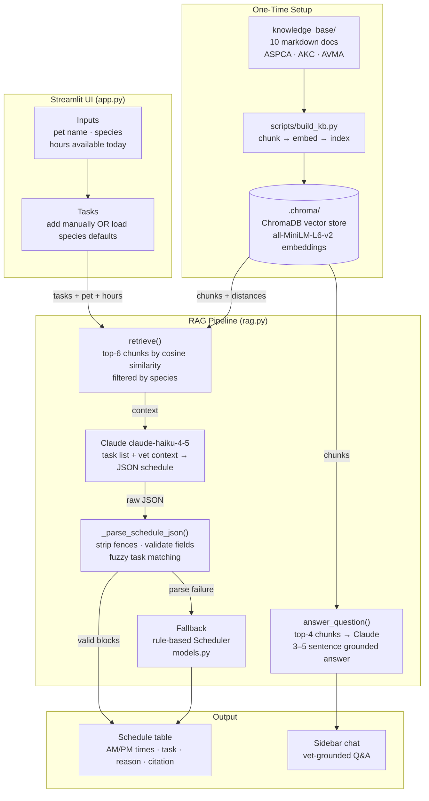

# PawPal+ System Architecture Diagram

```mermaid
flowchart TD
    subgraph setup["One-Time Setup"]
        KB["knowledge_base/\n10 markdown docs\nASPCA · AKC · AVMA"]
        BLD["scripts/build_kb.py\nchunk → embed → index"]
        VDB[(".chroma/\nChromaDB vector store\nall-MiniLM-L6-v2 embeddings")]
        KB --> BLD --> VDB
    end

    subgraph ui["Streamlit UI  (app.py)"]
        IN["Inputs\npet name · species\nhours available today"]
        TK["Tasks\nadd manually OR load species defaults"]
    end

    subgraph rag["RAG Pipeline  (rag.py)"]
        RTV["retrieve()\ntop-6 chunks by cosine similarity\nfiltered by species"]
        LLM["Claude claude-haiku-4-5\ntask list + vet context →\nJSON schedule"]
        PRS["_parse_schedule_json()\nstrip fences · validate fields\nfuzzy task matching"]
        FB["Fallback\nrule-based Scheduler\nmodels.py"]
        ANS["answer_question()\ntop-4 chunks → Claude\n3–5 sentence grounded answer"]
    end

    subgraph out["Output"]
        SCH["Schedule table\nAM/PM times · task · reason · citation"]
        CHAT["Sidebar chat\nvet-grounded Q&A"]
    end

    IN --> TK
    TK -->|tasks + pet + hours| RTV
    VDB -->|chunks + distances| RTV
    RTV -->|context| LLM
    LLM -->|raw JSON| PRS
    PRS -->|valid blocks| SCH
    PRS -->|parse failure| FB
    FB --> SCH
    VDB -->|chunks| ANS
    ANS --> CHAT
```
